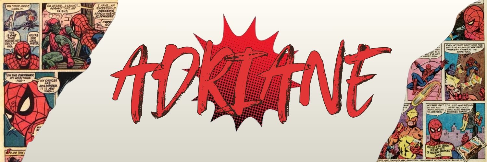

---

## 🕷️ About Me


- 🎓 IT Technician student focused on **software development**
- 🕸️ Passionate about **front-end** — if it's visual, I want to build it
- ⚙️ Diving into **back-end** to become a full-stack dev
- 🕷️ There's always a Spider-Man easter egg hidden in my personal projects
- 🌱 Always learning something new

<br clear="right"/>

---

## 🛠️ Tech Stack

<div align="center">

[](https://skillicons.dev)

</div>

---

## 🚀 Projects


### 🕸️ [Sistema de Autenticação e Gestão de Usuários](https://github.com/adrianebernardo/sistema-de-login)
> Aplicação web completa de login e cadastro com validações em tempo real e feedback visual — integrada ao Firebase Auth e Cloud Firestore.


🌐 [Ver projeto online](https://sistema-login-d0f98.web.app/)

<br clear="right"/>

---

## 📊 Stats

<div align="center">


</div>

---

## 🕷️ Easter Egg

<details>
<summary>Click here if you dare 🕸️</summary>

<br>

```
"No matter what anyone tells you, don't give up who you are."
— Peter Parker
```

> Every bug is just a villain waiting to be defeated. 🕸️

</details>

---

<div align="center">


</div>
